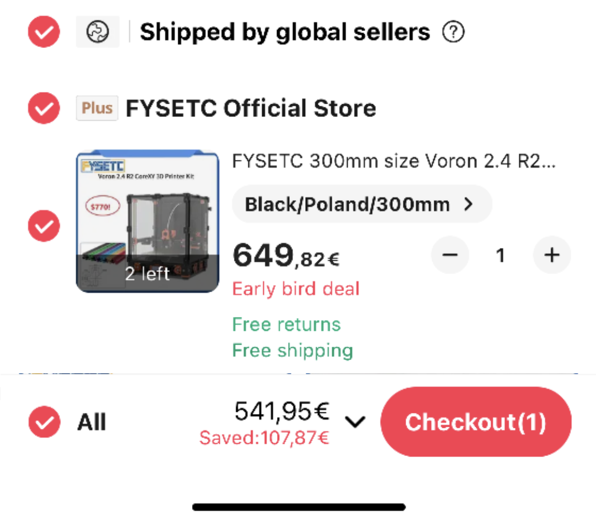
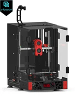

# Alternative

* If you're just looking for better Z movement then check out <https://kevinakasam.com/belt-driven-ender-3/>
* If you're want a overall better printer <https://github.com/yell3D/Ender3dent>
* If you don't know, sell/trash the Ender and buy a cheap Trident (preferred) or V2.4r2 300 kit on sale

(This price includes shipping and 19% Value Added Tax)

# Sourcing

The build in itself is expensive and may not as easy as you think. The current recommendation is to go for the Siboor kit as sourcing panels is a huge pita and really expensive.

You can find more information on [their GitHub site](https://github.com/Lzhikai/SIBOOR-E3-SW) and its available on their Ali-express site:

 (referral link)

# Things i knew before

* DO NOT BUY AN ENDER JUST TO CONVERT IT
* expensive
* its still a bedslinger, tho its a nice one and capable for producing fine prints
* huge footprint
* huge chamber to heat
* enclosure build and removal sux
* lose of Z height, worse with enclosure

# Links
Note: not actively monitored by me

* BOM
  * Siboor kit likely most up to date <https://github.com/Lzhikai/SIBOOR-E3-SW/blob/main/BOM.md>
  * original one <https://github.com/RobotRogue/Enderwire_Docs?tab=readme-ov-file#parts>
  * Alternative parts
    * KeyBak alternative
      * Mount <https://www.printables.com/model/470534-voron-switchwire-doorstopper>
* Conversions
  * Ender 3 non pro (original) <https://github.com/thomasfjen/enderwire_nonpro>
  * Ender 3 Pro / v2 <https://github.com/boubounokefalos/Ender_SW/>
  * Ender 3 Pro / v2 no Enclosure <https://github.com/RickG7191/EnderWire-Open>
  * Ender 3 Pro <https://github.com/EzrielDreamurr/Voron-Ender_3Pro_Switchwire>
  * CR 10 <https://github.com/alegiuk/CR10_SW>
  * Ender3 to Trident <https://github.com/yell3D/Ender3dent>
* Probes
  * Bltouch mount, because why not <https://www.printables.com/model/422291-sb-bltouch-reinforced-mount-for-axdl-spot>
  * Klicky for Switchwire <https://github.com/jlas1/Klicky-Probe/tree/main/Printers/Voron/Switchwire>
  * Beacon / Cartographer / IDM scanner
  * (old) <https://github.com/hymness1/VoronUsers/tree/master/printer_mods/hymness1/Quickdraw_probe_Voron_Switchwire>
  * (old) <https://github.com/salveoo/voronmods/tree/main/Switchwire%20Magprobe>
* Guides
  * <https://ellis3dp.com/Print-Tuning-Guide/>
  * CAN bus <https://canbus.esoterical.online/>  (sry dont on a Switchwire, get the LDO Nitehawk instead)
* random things
  * <https://github.com/SW-Conversion/mod-regisistry>
  * Bolted enclosure and 9mm belts <https://github.com/fauks/Xnderwire>
  * Creality board
    * Mini 12864 on  <https://github.com/yell3D/RNGprinterthings/tree/master/Mini12864>
    * NeoPixel <https://github.com/yell3D/RNGprinterthings/tree/master/Creality4.2.2NeoPixel>
    * Klicky Servo <https://github.com/yell3D/RNGprinterthings/tree/master/Creality4.2.2Servo>
    * Pinout <https://github.com/yell3D/RNGprinterthings/blob/master/Creality.4.2.2.-.Schematic.28-5-22.pdf>
  * Enclosure assemble (timestamped) <https://youtu.be/f55msyYjkwk?t=11295>
  * Enderwire R2 Stock Ender 3 v2 Power Inlet <https://www.printables.com/model/425040-enderwire-r2-stock-ender-3-v2-power-inlet>
