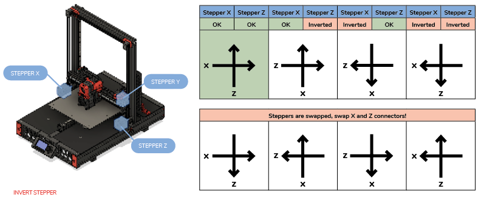

# Printer moves / homes in the wrong direction

## fix Z stepper
Verify that the rotation distance was changed from `8` (lead screw) to a pulley
```
[stepper_z]
(...)
rotation_distance: 40
```

## Y stepper on Enderwires (Microswitch at the rear)
Correct the positions as shown below and **remove** `homing_positive_dir: true`

```
[stepper_y]
(...)
position_endstop: 0
position_min: 0
position_max: 237
```

## Verify stepper movements
Verify that the steppers are plugged in the correct sockets (or pins assigned) and that they spin in the correct direction

put this in your printer.cfg and restart klipper
```
[force_move]
enable_force_move: True
```


1. Manually put the toolhead in the middle Z and X by hand and send:
    ```
    SET_KINEMATIC_POSITION X=60 Y=60 Z=50
    G91
    ```
2. Check X movement
    1. send: `G0 X5`
    2. Does it move the toolhead to the right?
3. Check Z movement
    1. send: `G0 Z5`
    2. Does it move up?
4. see Switchwire graphic to figure out what to change.




To invert a stepper add a `!` to the `dir_pin`.

```
dir_pin:  PB7  # <-- normal
dir_pin: !PB7  # <-- inverted
```

## Printer loses steps, prints wrong size

* You are likely using 18 instead of the 20 teeth pulleys.
  * Count the teeth on the pulley, rotation distance `rotation_distance = <belt_pitch> * <number_of_teeth_on_pulley>` . (2x18 = 36, 2x20 = 40))
* check if you use 0.9° instead of 1.8° steppers, adjust `full_steps_per_rotation` to `400`


## Diagonal Movements
Check the previous sections first, then return to this.


verify:
* grub screw's on the motors is tight
* belts have about the same tension
* there are no funny sounds, rubbing or belt jumping over the pulley/idler walls
* you are using `microsteps: 16` for Creality board or `microsteps: 32` (or higher) for all other that support tmc drivers

